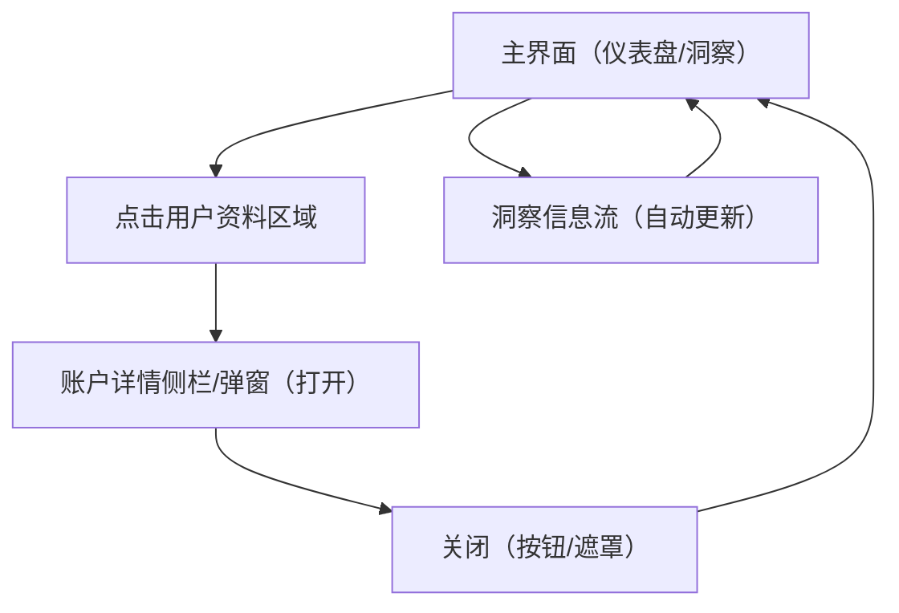

## 1. Product Overview
在现有交易/洞察主界面中，点击用户资料区域打开账户详情侧栏/弹窗，并清理冗余UI元素。
同时将页面中重复出现的洞察内容替换为随市场与新闻自动更新的洞察信息流。

## 2. Core Features

### 2.1 User Roles
| 角色 | 注册/登录方式 | 核心权限 |
|------|----------------|----------|
| 登录用户 | 现有登录体系（沿用现状） | 可查看账户详情；可查看自动更新洞察 |

### 2.2 Feature Module
本次需求涉及以下页面（最小可用集）：
1. **主界面（仪表盘/洞察）**：顶部用户资料入口；洞察信息流（自动更新、去重）；UI元素清理（移除指定 span/svg）。

### 2.3 Page Details
| Page Name | Module Name | Feature description |
|-----------|-------------|---------------------|
| 主界面（仪表盘/洞察） | 用户资料入口（Profile Div） | 点击用户资料区域（头像/昵称所在 div）打开右侧侧栏或居中弹窗；支持点击关闭按钮与点击遮罩关闭；打开时不触发页面跳转。 |
| 主界面（仪表盘/洞察） | 账户详情面板（Modal/Side Panel） | 展示账户详情信息（从现有用户数据源读取：如昵称/邮箱/用户ID/订阅状态等“已存在字段”）；只读展示；加载态与空态清晰可见。 |
| 主界面（仪表盘/洞察） | UI清理（移除指定元素） | 移除你已选定的 span/svg（例如重复装饰、分隔符、冗余图标等）；移除后不影响信息层级与可点击区域；保持对齐与间距一致。 |
| 主界面（仪表盘/洞察） | 洞察信息流（市场/新闻驱动） | 将页面中重复出现的洞察替换为“自动更新”的洞察列表：基于市场数据与新闻摘要生成/聚合；按时间排序；展示来源与更新时间；避免短时间内重复洞察（去重）。 |
| 主界面（仪表盘/洞察） | 自动更新机制 | 在页面可见时按固定周期拉取最新洞察；拉取失败时展示轻量错误提示且不阻塞其他区域；成功后无刷新更新列表内容。 |

## 3. Core Process
- 用户在主界面浏览洞察信息流：页面在可见状态下周期性刷新洞察内容，列表自动更新并去重。
- 用户点击顶部用户资料区域：页面右侧打开侧栏（或弹窗）展示账户详情；用户可点击“关闭”或遮罩关闭面板，回到主界面原位置。
- 设计/前端清理指定 span/svg：移除后保持布局稳定，洞察与用户资料交互不受影响。

