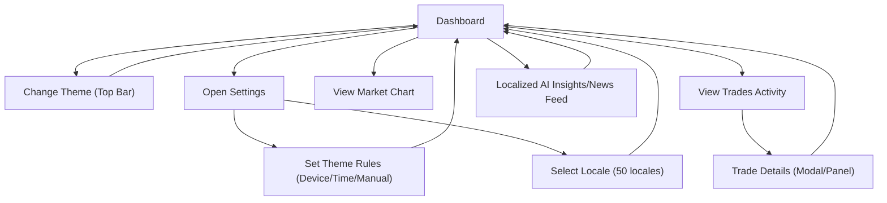

## 1. Product Overview
Improve the dashboard experience by adding a smart dark/light mode that follows device + time rules, a global language switcher (50 locales), and richer market context via chart + trade activity and localized AI insights/news.

## 2. Core Features

### 2.1 User Roles
| Role | Registration Method | Core Permissions |
|------|---------------------|------------------|
| User | Existing login system (keep current behavior) | Can use theme + language preferences; can view charts, trade activity, and localized insights/news |

### 2.2 Feature Module
The requirements consist of the following main pages:
1. **Dashboard**: global top bar (theme + language); market chart; trades activity; localized AI insights/news feed.
2. **Settings**: theme rules (device/time/manual); language & region preferences; preview and persistence.

### 2.3 Page Details
| Page Name | Module Name | Feature description |
|-----------|-------------|---------------------|
| Dashboard | Global top bar | Switch language (50 locales) globally; toggle theme mode; indicate current auto rule (Device/Time/Manual). |
| Dashboard | Smart theme engine | Apply consistent theme tokens across UI (background, text, borders, chart colors). Resolve theme by priority: Manual override > Time-based schedule > Device setting (prefers-color-scheme). Persist preference locally and (if logged in) to user profile. |
| Dashboard | Market chart | Show primary price chart with selectable timeframe; reflect theme colors (gridlines, candles/lines, tooltip); show loading/empty/error states. |
| Dashboard | Trades activity | Display recent trade/activity list (time, symbol, side, qty, price, status). Support basic filters (symbol, side) and sorting by time; allow clicking an item to view more details (modal/panel). |
| Dashboard | Localized AI insights/news | Show an insights/news feed localized to current locale: headlines + short summaries + timestamps; allow refresh and incremental update; dedupe near-duplicate items; show source attribution and “last updated”. |
| Dashboard | Locale-aware formatting | Format numbers, currency, dates, and timezones using the active locale; ensure chart axes and tooltips follow locale formatting. |
| Settings | Theme preferences | Configure theme mode: (1) Follow device, (2) Time-based schedule (start/end, timezone), (3) Manual Light/Dark. Provide preview and “Reset to default”. |
| Settings | Language preferences | Select locale from a searchable list of 50 locales; define fallback locale (default English); support RTL layout automatically for RTL locales. |
| Settings | Preference persistence | Save preferences instantly; keep last-used preferences across sessions/devices when logged in (server-stored), otherwise use local storage only. |

## 3. Core Process
- Theme flow: you change Theme Mode (Manual/Device/Time). The app immediately updates all UI colors (including charts) and persists the preference; if Time-based is enabled, the app auto-switches at the configured times in your timezone.
- Language flow: you select a locale in the global language switcher; the entire UI re-renders in that locale, and AI insights/news refresh to the localized version; dates/numbers reformat accordingly.
- Activity flow: on the dashboard you review the chart, then scan recent trade activity; selecting an item opens details; insights/news continues to update in the background with dedupe.

