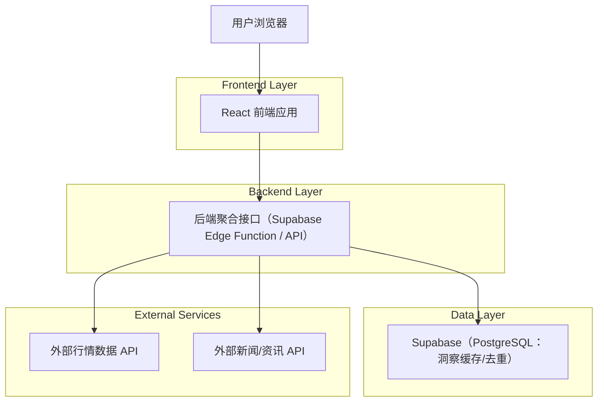
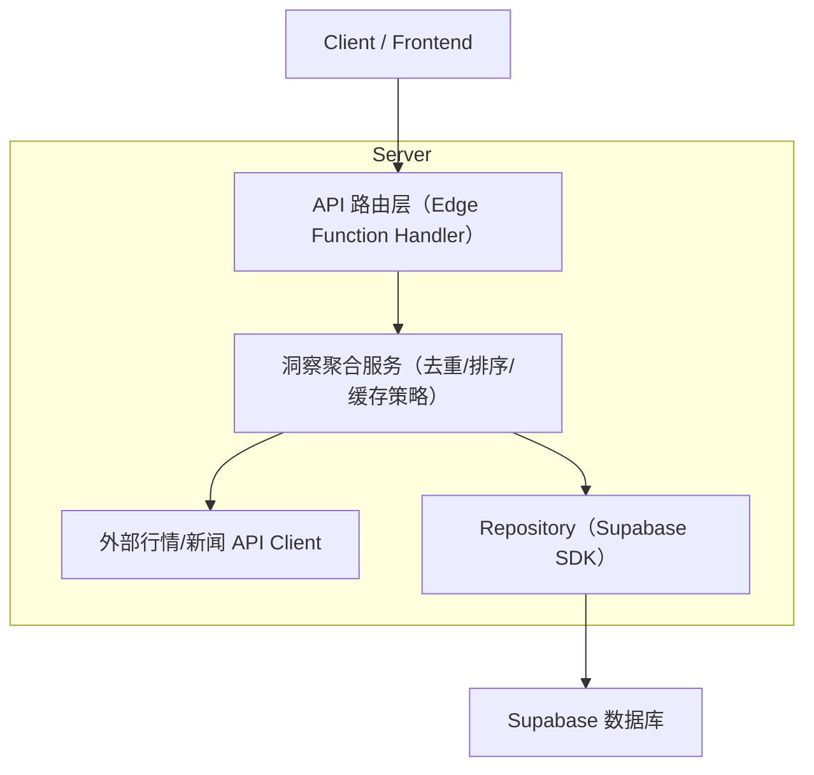
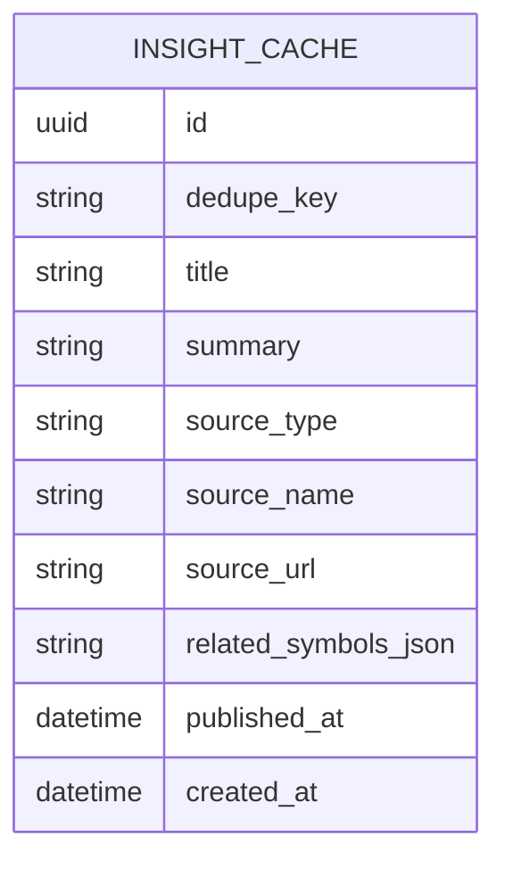

## 1.Architecture design


## 2.Technology Description
- Frontend: React@18 + TypeScript + vite + tailwindcss@3
- Backend: Supabase Edge Functions（用于安全调用外部行情/新闻 API，并聚合返回洞察）
- Database: Supabase PostgreSQL（用于洞察缓存、去重与限流保护；可选）

## 3.Route definitions
| Route | Purpose |
|-------|---------|
| / | 主界面（仪表盘/洞察），包含用户资料入口、洞察信息流与账户详情侧栏/弹窗 |

## 4.API definitions (If it includes backend services)
### 4.1 Core API
洞察聚合（自动更新拉取）

`GET /api/insights`

Request Headers:
| Header | Type | isRequired | Description |
|--------|------|------------|-------------|
| Authorization | string | false | 如你现有体系有登录态，可传 Bearer token 用于个性化/限流（沿用现状） |

Query:
| Param Name | Param Type | isRequired | Description |
|-----------|------------|-----------|-------------|
| limit | number | false | 返回条数（默认 20） |
| since | string | false | ISO 时间戳，仅返回该时间之后的洞察（用于增量刷新） |

Response（示例类型，前后端共用 TS 类型）:
```ts
type InsightItem = {
  id: string
  title: string
  summary: string
  sourceType: "market" | "news"
  sourceName: string
  sourceUrl?: string
  relatedSymbols?: string[]
  publishedAt: string // ISO
  createdAt: string // ISO（系统聚合时间）
  dedupeKey: string // 用于去重
}

type InsightsResponse = {
  items: InsightItem[]
  serverTime: string
}
```

## 5.Server architecture diagram (If it includes backend services)


## 6.Data model(if applicable)
### 6.1 Data model definition


### 6.2 Data Definition Language
Insight 缓存表（insight_cache）
```sql
CREATE TABLE insight_cache (
  id UUID PRIMARY KEY DEFAULT gen_random_uuid(),
  dedupe_key TEXT NOT NULL,
  title TEXT NOT NULL,
  summary TEXT NOT NULL,
  source_type TEXT NOT NULL, -- 'market' | 'news'
  source_name TEXT NOT NULL,
  source_url TEXT,
  related_symbols_json TEXT, -- JSON stringify
  published_at TIMESTAMPTZ,
  created_at TIMESTAMPTZ DEFAULT NOW()
);

CREATE UNIQUE INDEX idx_insight_cache_dedupe_key ON insight_cache(dedupe_key);
CREATE INDEX idx_insight_cache_created_at ON insight_cache(created_at DESC);

-- permissions (按 Supabase 指南：匿名可读、登录态全权限；如你现有策略不同以现状为准)
GRANT SELECT ON insight_cache TO anon;
GRANT ALL PRIVILEGES ON insight_cache TO authenticated;
```
