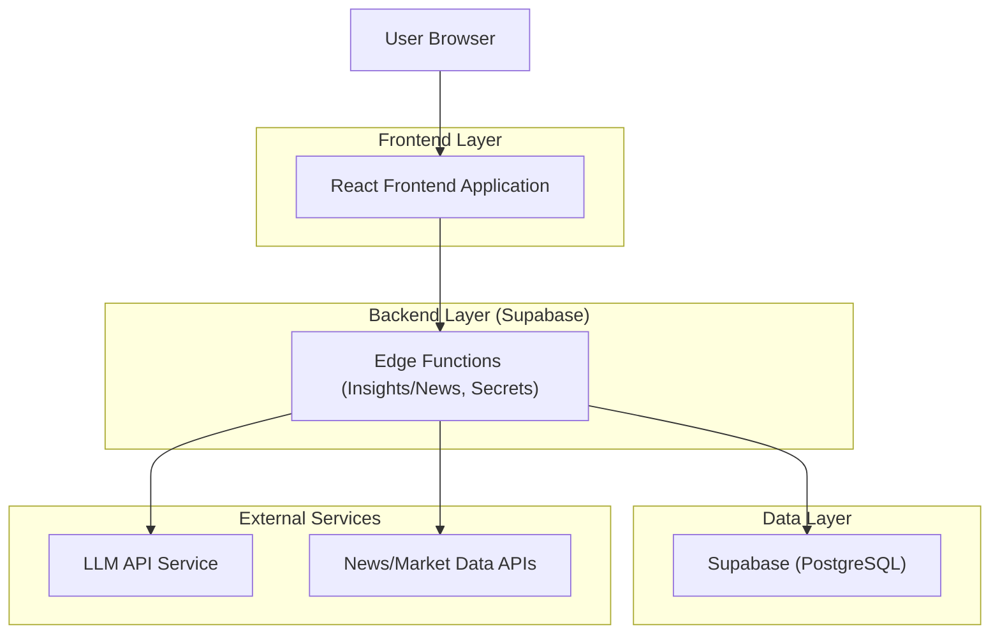
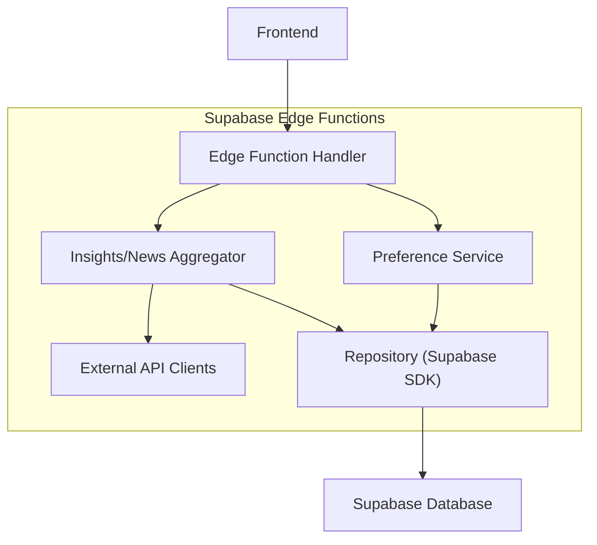
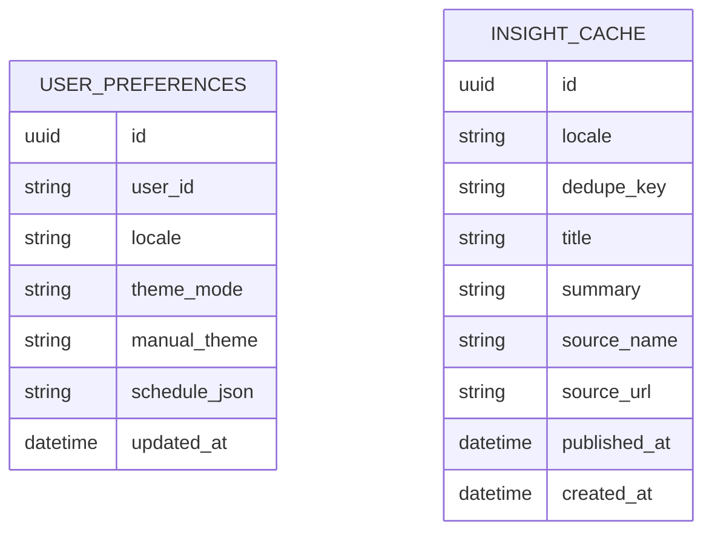

## 1.Architecture design


## 2.Technology Description
- Frontend: React@18 + TypeScript + vite + tailwindcss@3
- i18n: i18next + react-i18next (dynamic locale bundle loading, fallback to en)
- Theme: CSS variables + Tailwind (tokenized colors), prefers-color-scheme integration
- Backend: Supabase Edge Functions (call LLM/news APIs securely; caching/dedupe)
- Database: Supabase PostgreSQL (preferences + localized insights/news cache; trade activity if needed)

## 3.Route definitions
| Route | Purpose |
|-------|---------|
| / | Dashboard (chart, trades activity, localized AI insights/news, global theme + language controls) |
| /settings | Theme schedule/device/manual settings; locale selection; persistence |

## 4.API definitions (If it includes backend services)
### 4.1 Core types (shared)
```ts
type ThemeMode = "device" | "time" | "manual"

type ThemePreference = {
  mode: ThemeMode
  manualTheme?: "light" | "dark"
  schedule?: { startLocalTime: string; endLocalTime: string; timeZone: string }
}

type UserPreferences = {
  locale: string // BCP-47, e.g. "en-US"
  theme: ThemePreference
  updatedAt: string
}

type InsightItem = {
  id: string
  locale: string
  title: string
  summary: string
  sourceName: string
  sourceUrl?: string
  publishedAt: string
  createdAt: string
  dedupeKey: string
}
```

### 4.2 Edge Function endpoints
`GET /functions/v1/insights?locale=xx-YY&limit=20&since=ISO`
- Returns localized insights/news items, deduped and time-sorted.

`POST /functions/v1/preferences`
- Upserts user preferences (locale + theme settings) for logged-in users.

## 5.Server architecture diagram (If it includes backend services)


## 6.Data model(if applicable)
### 6.1 Data model definition


### 6.2 Data Definition Language
User preferences (user_preferences)
```sql
CREATE TABLE user_preferences (
  id UUID PRIMARY KEY DEFAULT gen_random_uuid(),
  user_id TEXT NOT NULL,
  locale TEXT NOT NULL,
  theme_mode TEXT NOT NULL, -- 'device' | 'time' | 'manual'
  manual_theme TEXT, -- 'light' | 'dark'
  schedule_json TEXT, -- JSON stringify {startLocalTime,endLocalTime,timeZone}
  updated_at TIMESTAMPTZ DEFAULT NOW()
);

CREATE UNIQUE INDEX idx_user_preferences_user_id ON user_preferences(user_id);

GRANT SELECT ON user_preferences TO anon;
GRANT ALL PRIVILEGES ON user_preferences TO authenticated;
```

Localized insights/news cache (insight_cache)
```sql
CREATE TABLE insight_cache (
  id UUID PRIMARY KEY DEFAULT gen_random_uuid(),
  locale TEXT NOT NULL,
  dedupe_key TEXT NOT NULL,
  title TEXT NOT NULL,
  summary TEXT NOT NULL,
  source_name TEXT NOT NULL,
  source_url TEXT,
  published_at TIMESTAMPTZ,
  created_at TIMESTAMPTZ DEFAULT NOW()
);

CREATE UNIQUE INDEX idx_insight_cache_locale_dedupe ON insight_cache(locale, dedupe_key);
CREATE INDEX idx_insight_cache_created_at ON insight_cache(created